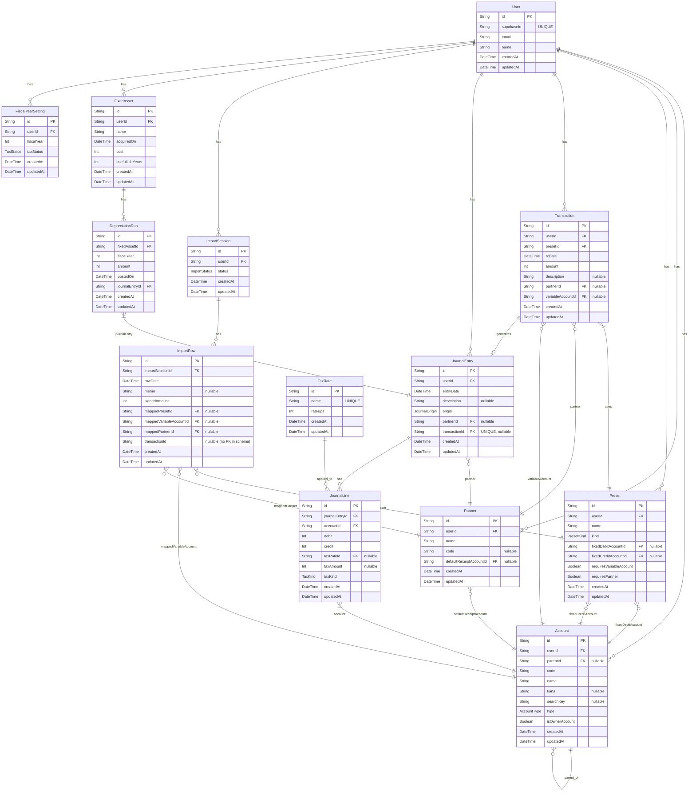

# bookkeeping

個人事業主向け会計アプリ

## 技術スタック

- Next.js 16 (App Router)
- React 19
- TypeScript
- Prisma (PostgreSQL)
- Supabase Auth
- Tailwind CSS v4
- react-hook-form + zod
- react-hot-toast

## コマンド

```bash
# 依存関係インストール
pnpm install

# 開発サーバー起動
pnpm dev

# ビルド
pnpm build

# 本番サーバー起動
pnpm start

# Lint
pnpm lint

# Prismaクライアント生成
pnpm prisma generate

# マイグレーション作成
pnpm prisma migrate dev --name <migration_name>

# マイグレーション適用(本番)
pnpm prisma migrate deploy

# シードデータ投入
pnpm prisma db seed

# Prisma Studio(DBブラウザ)
pnpm prisma studio
```

## ER図
